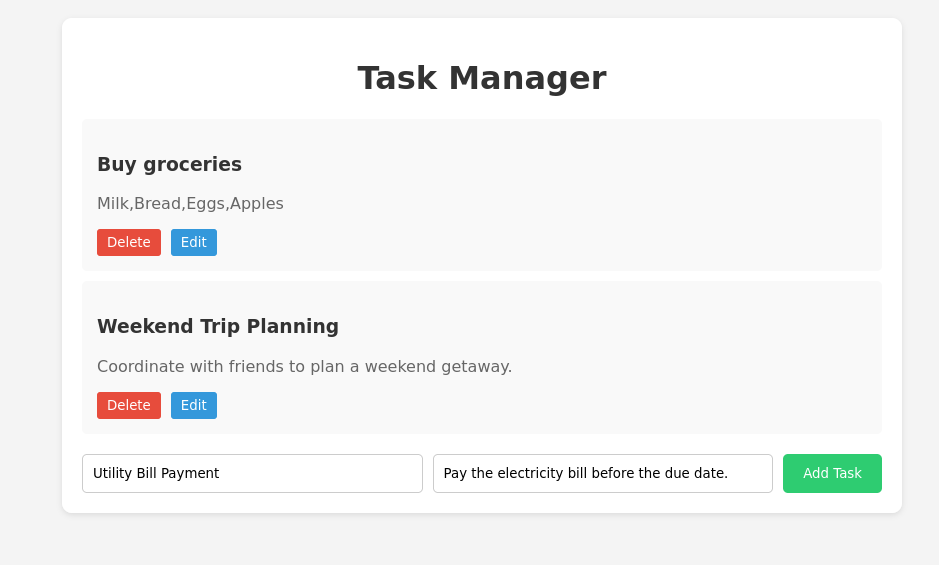
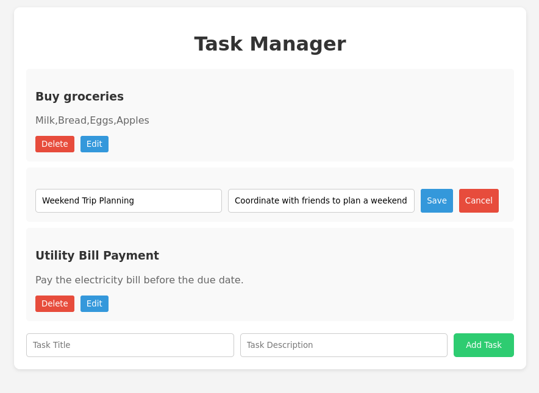

# Task Manager




This Task Manager project is created as a learning exercise for integrating Vue.js and MongoDB. It provides a simple interface for managing tasks, allowing users to add, delete and update tasks.

## Features

- [X] **Task Creation**: Users can add tasks with a title, description, and due date.
- [X] **Task Deletion**: Tasks can be deleted individually.
- [X] **Task Update**: Users can edit task details such as title, description, and due date.
- [ ] **Task Completion**: Users can mark tasks as completed.
- [ ] **Filtering Tasks**: Tasks can be filtered based on completion status or due date.

## Technologies Used

- **Vue.js**: Frontend framework for building user interfaces.
- **MongoDB**: NoSQL database for storing task data.
- **Node.js**: Backend runtime environment.
- **Express.js**: Web application framework for Node.js.
- **RESTful API**: Interface for communication between frontend and backend.

## Installation

1. Install dependencies:

   ```bash
   npm run install # or
   pnpm run pnpm-install
   ```

2. Set up MongoDB:
   - Install MongoDB on your system if not already installed.
   - Start MongoDB server.

3. Configure environment variables:
   - Create a `.env` file in the root directory.
   - Define the following variables:
     ```
     MONGODB_URI=your_mongodb_connection_uri
     PORT=3000
     ```
4. Build client part:
    
    ```bash
    npm run build
    ```

5. Start the server:

   ```bash
   npm run serve
   ```

5. Access the application at `http://localhost:3000` in your browser.

## Usage

- Upon accessing the application, you'll see a list of tasks.
- To add a new task, click on the "Add Task" button and fill in the details.
- To delete a task, click on the delete icon next to the task.
- To update a task, click on the edit icon next to the task and modify the details.
